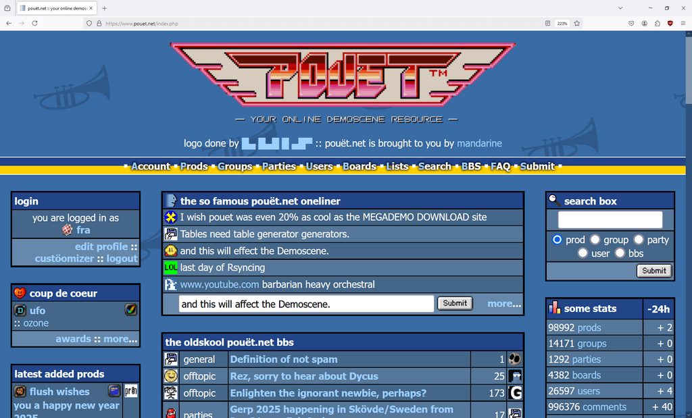

# Pouet/ftp.scene.org database parser/mapper

A Python script designed to make the Pouet.net database more readable and create direct links to a local backup of the files originaly hosted on `ftp.scene.org`.

## Project Goal

The goal of this project is to parse the Pouet.net database dumps, classify productions (prods) by platform, and map their download links from `ftp.scene.org` to a local backup. This (should) allow easier exploration and access to demoscene productions offline.

### What is this all about?

- The demoscene is an international computer art subculture focused on creating demos — small, self-contained audiovisual programs that showcase technical and artistic skills. These productions often push the limits of hardware capabilities and demonstrate creative coding and design.
 - [Pouet.net](https://www.pouet.net) is the central online hub for the demoscene community. It serves as a database of demoscene productions, providing metadata, download links, and community feedback like comments and votes for each production. Pouet itself _DOES NOT HOST_ demoscene productions.
 - [Scene.org](https://scene.org) is a non-profit organization dedicated to archiving demoscene content. The `ftp.scene.org` server hosts a vast collection of demos, tools, and resources, making it a cornerstone for preserving the history of the demoscene.

### How the Script Works

1. **Fetch Data**: Downloads the latest Pouet.net database dump.
2. **Parse and Classify**: Processes the dump, organizing productions by platform and checking for download links.
3. **Remap Links**: Maps download links from `ftp.scene.org` to a local backup location.
4. **Save Results**: Saves classified productions into JSON files for easy access.

## Functions Overview

This document provides an overview of the key functions in the script, focusing on their role in handling Pouet.net data and resolving download links to a local backup of `ftp.scene.org`.

### `fetch_data()`

- **Purpose**: Fetches the latest production dump from Pouet.net.
- **Details**:
  - Connects to the Pouet.net API to retrieve metadata about all available database dumps.
  - Downloads the most recent dump (a compressed JSON file) and saves it locally for further processing.
- **Why It Matters**:
  - Pouet.net hosts metadata about demoscene productions. This function ensures you are working with the most up-to-date data.

### `parse_and_classify(filename, platforms, scene_org_local_copy, scene_org_roots)`

- **Purpose**: Reads the downloaded Pouet.net dump and organizes productions by platform.
- **Details**:
  - Unzips and parses the JSON dump file.
  - Iterates through each production, checking if it has a download link.
  - If the link is hosted on `ftp.scene.org`, it remaps the URL to point to a local backup directory.
  - Classifies productions based on their platform (e.g., Amstrad CPC, Amiga AGA).
- **Why It Matters**:
  - Helps you organize and access productions by platform.
  - Resolves links to local files, enabling offline exploration of archived content.

### `save_platform_data(platform_dict)`

- **Purpose**: Saves the classified productions into JSON files, organized by platform.
- **Details**:
  - Creates a `db/` directory if it doesn’t exist.
  - For each platform, writes its associated productions to a separate JSON file (e.g., `db/amiga_aga.json`).
- **Why It Matters**:
  - Provides a structured and easily accessible format for exploring productions offline.

### `fetch_pouet_prods(platforms, scene_org_local_copy, scene_org_roots)`

- **Purpose**: High-level orchestration function that ties together the data fetching, classification, and saving steps.
- **Details**:
  - Calls `fetch_data()` to download the latest Pouet.net dump.
  - Passes the dump to `parse_and_classify()` for processing and classification.
  - Saves the results using `save_platform_data()`.
- **Why It Matters**:
  - Acts as the main workflow for processing Pouet.net data and resolving links.

### `fetch_platforms()`

- **Purpose**: Retrieves a list of supported platforms from the Pouet.net API.
- **Details**:
  - Queries Pouet.net for a list of all platforms (e.g., Amiga, SNES).
  - Returns the list in alphabetical order for consistency.
- **Why It Matters**:
  - Dynamically fetches the platform list to ensure compatibility with new platforms added to Pouet.net.

### Constants

#### `SCENE_ORG_FTP_ROOT`
- Base URL for files hosted on `ftp.scene.org`.
- Used to identify and remap links to the local backup.

#### `SCENE_ORG_HTTP_ROOT`
- HTTP mirror of `ftp.scene.org`. Mirrors on scene.org exist to distribute the load across multiple servers, ensuring faster downloads and higher availability of demoscene files for users worldwide.
- Also used for link remapping.
